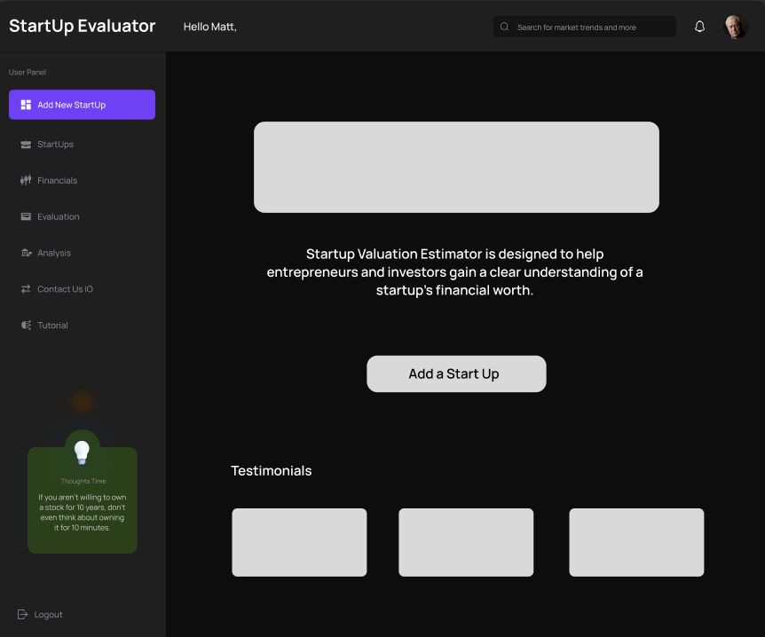
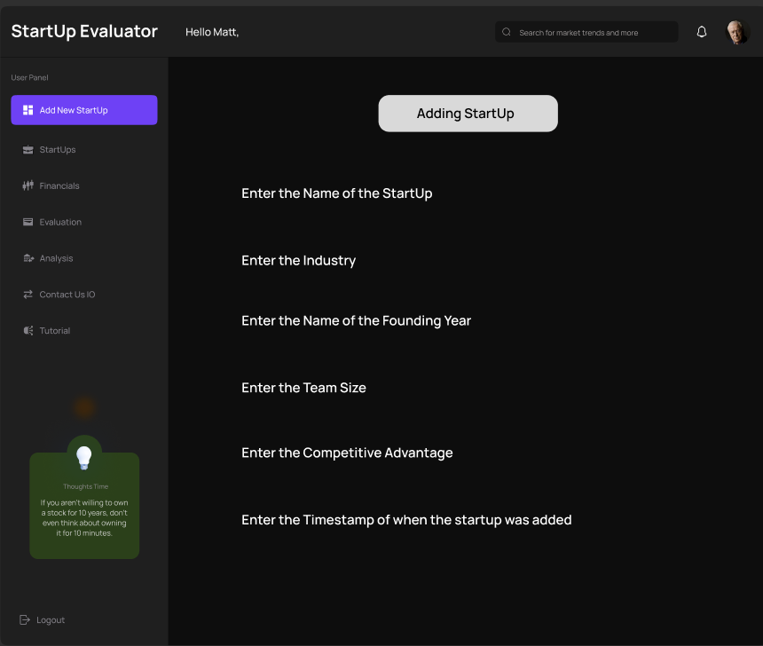
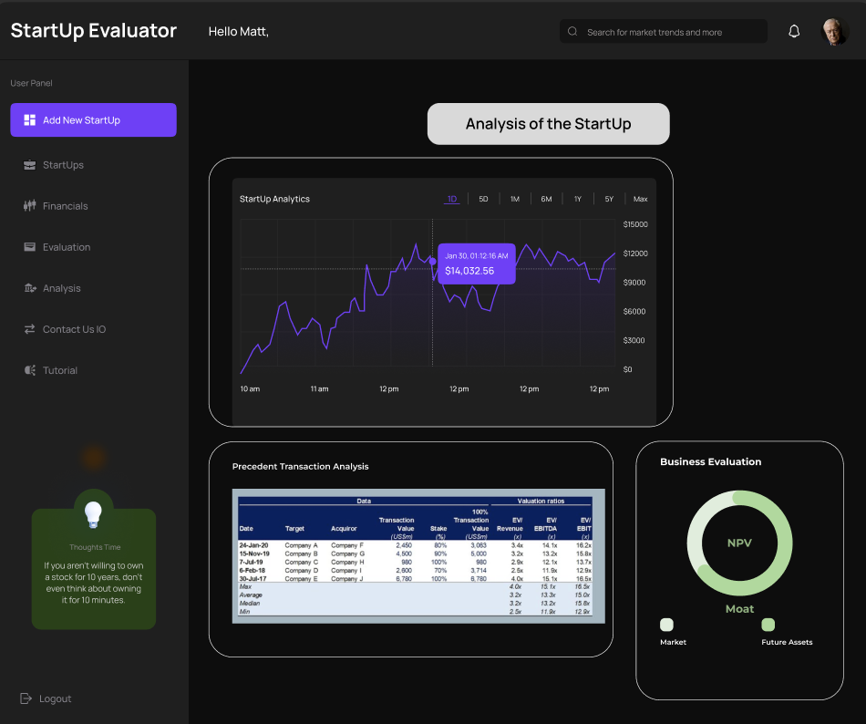
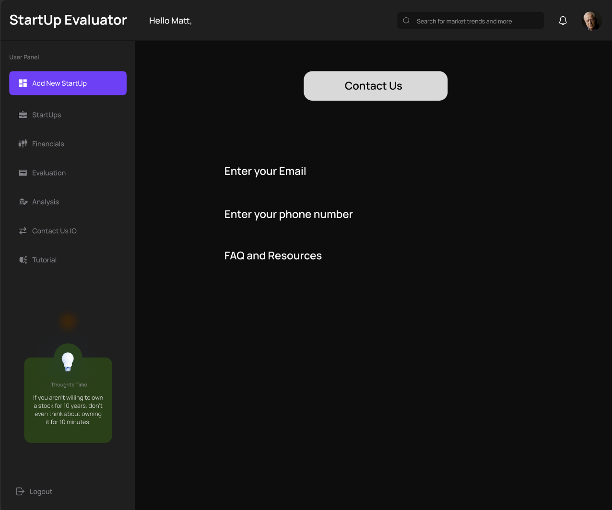

The content below is an example project proposal / requirements document. Replace the text below the lines marked "__TODO__" with details specific to your project. Remove the "TODO" lines.

# Interactive Data Exploration Tool

## Overview

The Interactive Data Exploration Tool is a web application designed to help users upload and manually input data, analyze it, and visualize the results using various charting techniques. Users can upload CSV files or enter data manually to gain insights through visualizations such as bar charts, line charts, and pie charts. This tool aims to provide a simplified platform for data exploration, making it accessible even to users without a technical background.

The goal of this project is to create a functional, user-friendly interface where users can interact with their data, visualize trends, and perform basic analysis like filtering and sorting. The tool supports file uploads and allows users to store and manage their data securely.

## Data Model

The application will store information about users, their uploaded datasets, and the analyses performed on the data. Each dataset will be associated with a user and will contain information such as raw data, visualizations, and metadata.
  * Each user can have multiple datasets.
  * Each dataset can have various forms of visualizations and analyses.

Example StartupInfo Document:

```javascript
{
  username: "john_doe",
  email: "john@example.com",
  password: "hashedPassword",
  createdAt: "2024-01-01T00:00:00.000Z"
}

```

## [Link to Commented First Draft Schema](db.mjs) 
db.mjs

## Wireframes

- Homepage section


- Startup section


- Analysis section


- Contact section


## Site map


## User Stories or Use Cases

1. As a user, I can upload a CSV file to the application for analysis and visualization.
2. As a user, I can manually input data to create a dataset if I do not have a CSV file.
3. As a user, I can visualize my data using different chart types (e.g., bar chart, line chart).
4. As a user, I can filter and sort my dataset to gain specific insights.
5. As a user, I can save my datasets and analyses for later use.
6. As a user, I can view and compare results from different visualizations to make data-driven decisions

## Research Topics

* Unit Testing (3 points):
    * I will use Jest for unit testing key functions, especially those related to valuation calculations. This will help ensure the accuracy and reliability of the valuation models.
* CSS Framework (2 points):
    * Tailwind CSS will be integrated for consistent styling and layout, enabling me to create a clean and modern interface for the application
* Server-Side JavaScript Library (3 point):
    * Multer will be used for handling file uploads in the backend. Multer is a middleware for Express.js that helps manage multipart/form-data, enabling users to upload CSV files seamlessly. It will be integrated to handle file storage and parsing.
* Client-Side JavaScript Library (3 point):
    * D3.js will be used for creating dynamic, interactive visualizations such as bar charts, line charts, and pie charts. It will provide the ability to visualize the data and allow users to interact with it in a meaningful way.

Total: 11 points

## [Link to Initial Main Project File](app.mjs) 

(__TODO__: create a skeleton Express application with a package.json, app.mjs, views folder, etc. ... and link to your initial app.mjs)

```
views/
├── main.hbs                   # Main layout file
├── header.hbs                 # Header partial
├── footer.hbs                 # Footer partial
├── homepage.hbs               # Homepage view template
├── dataset-upload.hbs         # Page for uploading datasets
├── dataset-entry.hbs          # Page for manual data entry
├── data-analysis.hbs          # Page for performing analysis
├── visualizations.hbs         # Page for displaying visualizations
└── contact-us.hbs             # Contact Us page

app.mjs
db.mjs
package.json
package-lock.json
app.mjs
db.mjs
package.json
package-lock.json
```


## Annotations / References Used

1. [figma for wireframe](https://www.figma.com/design/)
